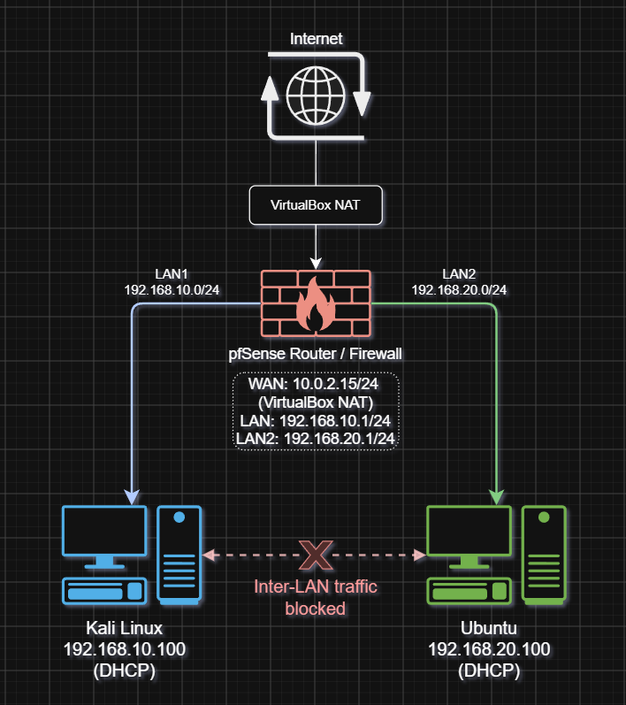
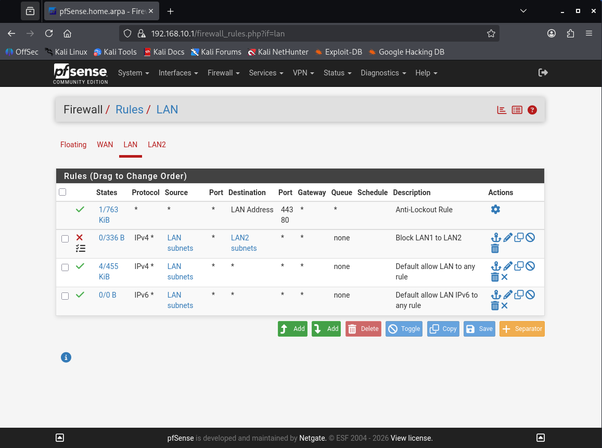
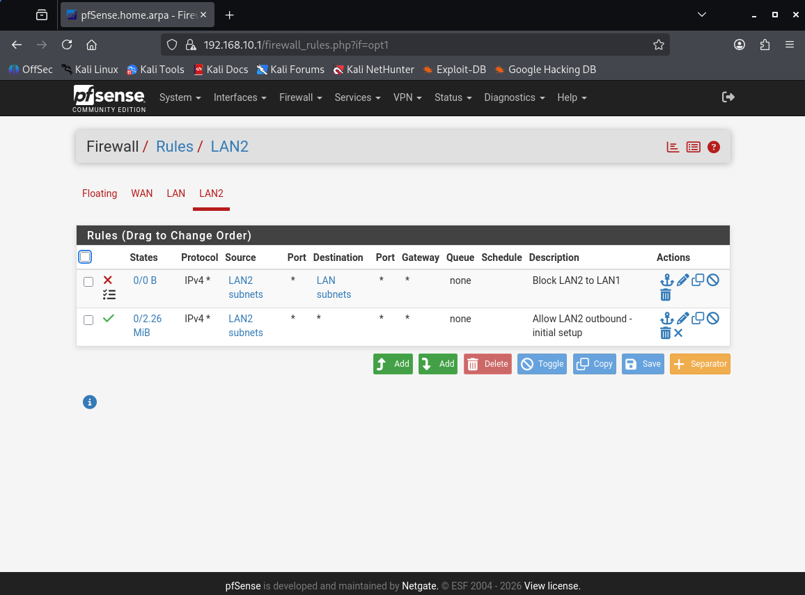
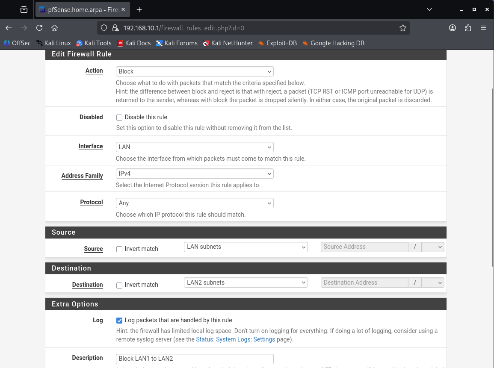
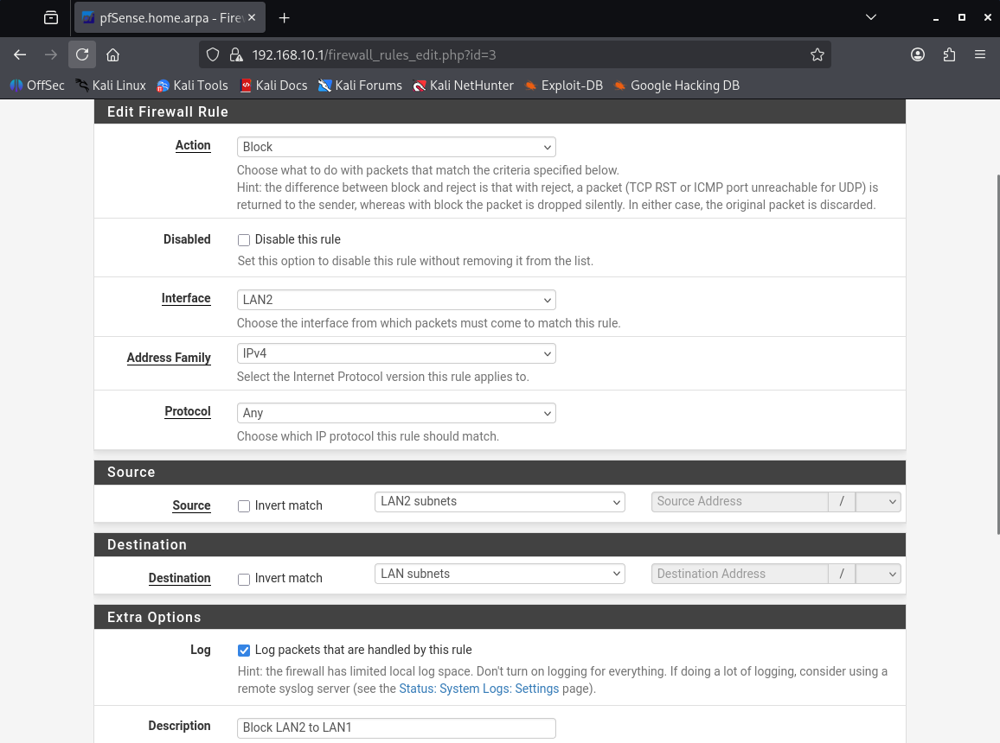
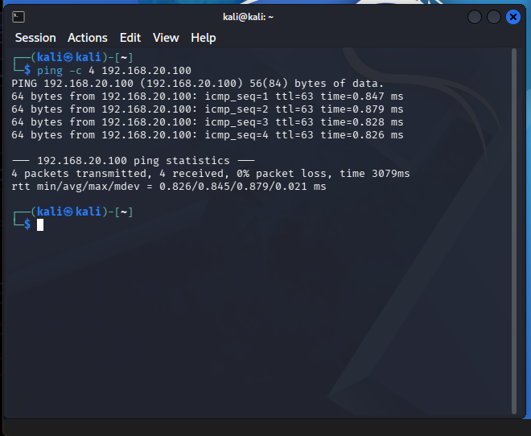
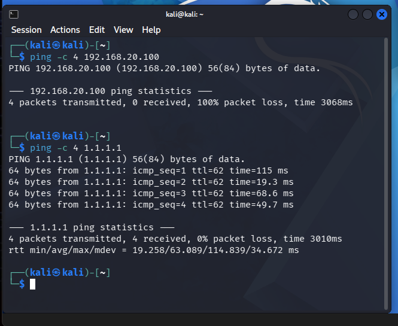
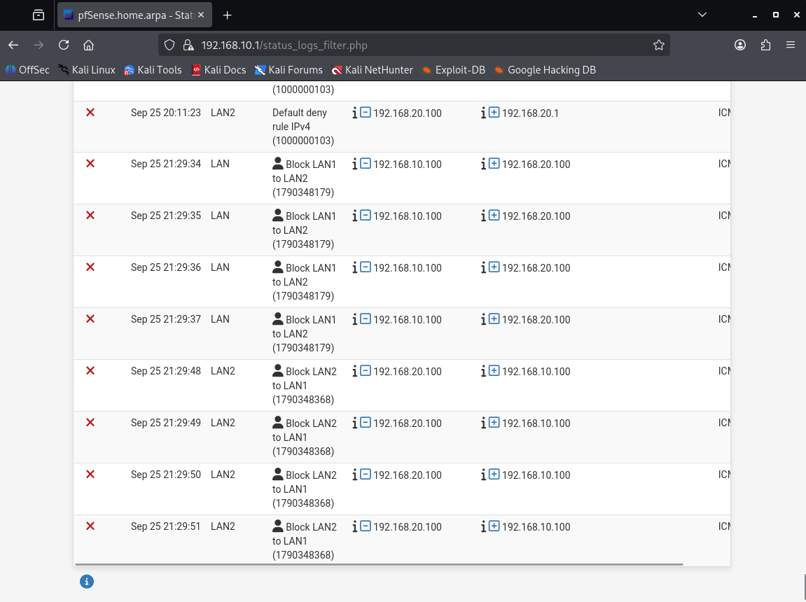
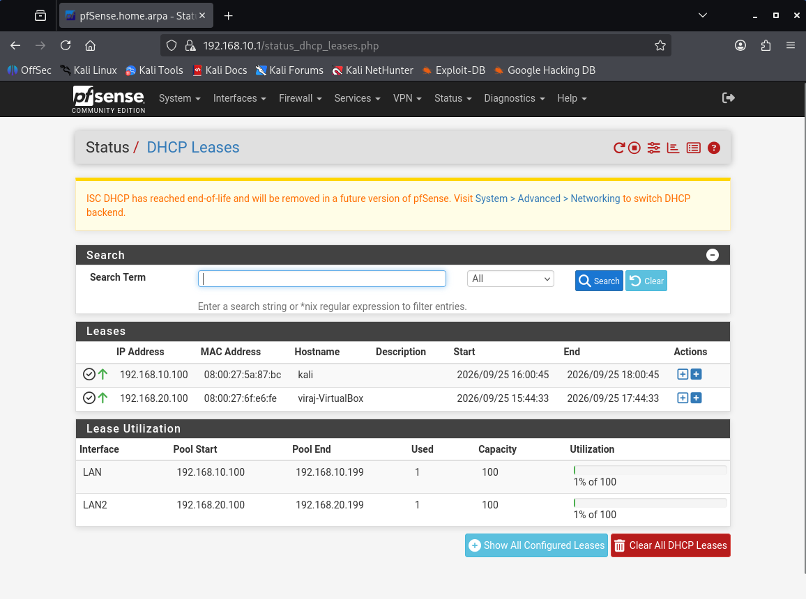

# pfSense Network Segmentation Lab

A virtualized network lab demonstrating LAN segmentation and firewall-based access control using pfSense.

## Overview

I built a segmented network lab in VirtualBox using pfSense as a router and firewall, with two client VMs (Kali Linux and Ubuntu) placed on separate LANs, `192.168.10.0/24` and `192.168.20.0/24`. Both LANs had full internet access via NAT through pfSense's WAN interface.

## Topology

| Component | Details |
|---|---|
| Firewall / Router | pfSense CE 2.9.0 |
| WAN | VirtualBox NAT (`10.0.2.15/24`) |
| LAN1 | `192.168.10.0/24`, gateway `192.168.10.1` |
| LAN2 | `192.168.20.0/24`, gateway `192.168.20.1` |
| Client 1 | Kali Linux, `192.168.10.100` (DHCP) |
| Client 2 | Ubuntu, `192.168.20.100` (DHCP) |

## What I configured

- Created the pfSense VM in VirtualBox with a WAN adapter on NAT (for internet access) and two LAN adapters on isolated internal networks
- Installed pfSense CE 2.9.0 and set up LAN1 (`192.168.10.1/24`) and LAN2 (`192.168.20.1/24`) with DHCP enabled on both
- Connected Kali Linux to LAN1 and Ubuntu to LAN2, confirmed both received DHCP leases and had internet access through pfSense
- Added an outbound allow rule on LAN2, since a newly added interface in pfSense has no allow rules and its traffic hits the default deny rule
- Configured block rules on both LAN interfaces to drop all IPv4 traffic between `192.168.10.0/24` and `192.168.20.0/24`, while leaving internet access unaffected
- Verified the rules using ICMP (ping) as the test protocol, with logging enabled to confirm which rule was dropping the traffic

## Firewall rules

| Interface | Action | Protocol | Source | Destination | Description |
|---|---|---|---|---|---|
| LAN | Block | IPv4 (any) | LAN subnets | LAN2 subnets | Block LAN1 to LAN2 |
| LAN | Pass | IPv4 (any) | LAN subnets | any | Default allow LAN to any |
| LAN2 | Block | IPv4 (any) | LAN2 subnets | LAN subnets | Block LAN2 to LAN1 |
| LAN2 | Pass | IPv4 (any) | LAN2 subnets | any | Allow LAN2 outbound |

pfSense evaluates rules top to bottom and applies the first match. Each block rule sits above its interface's allow rule, so inter-LAN traffic is dropped before the allow rule is reached. If the order were reversed, the allow rule would match first and the block would never apply.

The rules use **Block** (silent drop) rather than **Reject**, so the sender gets no response and the connection simply times out.

| LAN rules | LAN2 rules |
|---|---|
|  |  |

| Rule: LAN1 to LAN2 | Rule: LAN2 to LAN1 |
|---|---|
|  |  |

## Before / After

**Before:** both LANs could freely communicate with each other and with the internet.

**After:** inter-LAN traffic is blocked at the firewall; internet access remains fully functional for both subnets. Kali gets 100% packet loss to Ubuntu (`192.168.20.100`) but still reaches `1.1.1.1`.

## Evidence

Firewall logs show the dropped packets in both directions, each tagged with the rule that blocked it:

DHCP leases confirming each client received an address on its own subnet:

## What I learned

How firewall rule order and priority determine which rule actually applies when multiple rules could match the same traffic, and how to validate a security control empirically (via testing and logs) rather than just trusting the configuration as written.

## Next steps

- Add more granular rules (e.g., allow only specific ports/services between LANs, or restrict outbound internet access to an allowlist of destinations)
- Layer an IDS/IPS (Suricata/Snort) on top of this lab to detect and log intrusion attempts
- Use the logs this lab generates as input for a Python/SQL log-analysis project
